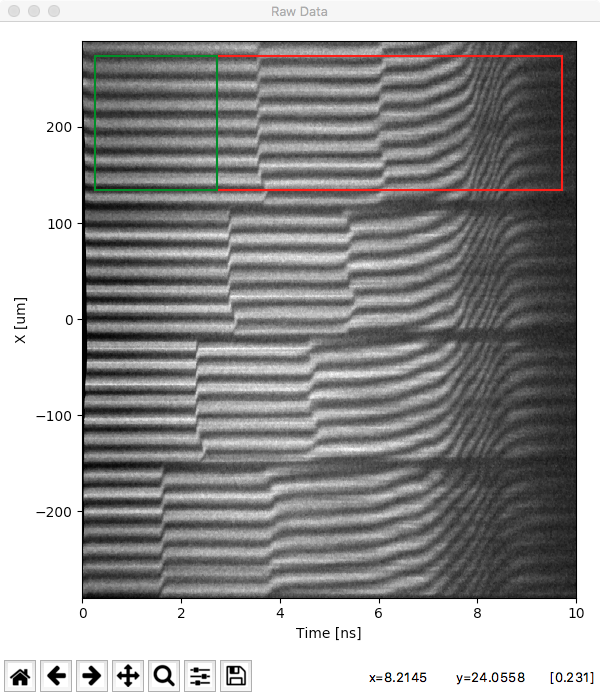
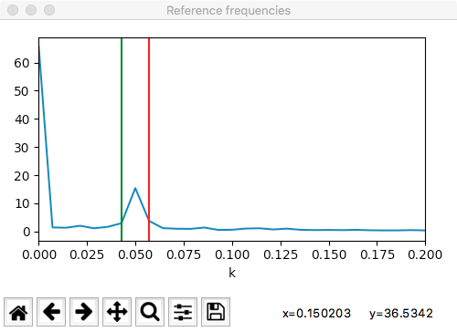
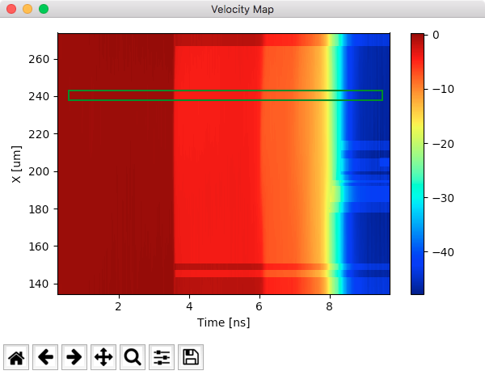
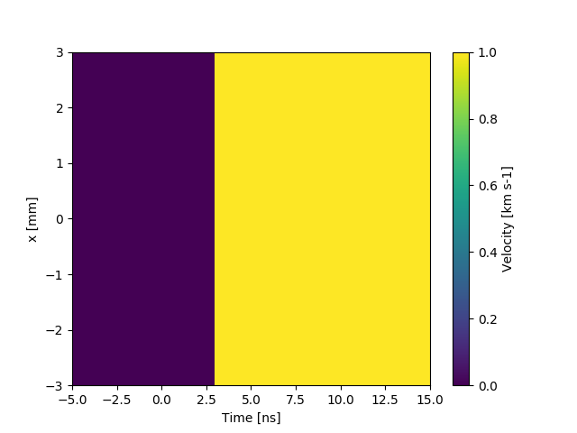
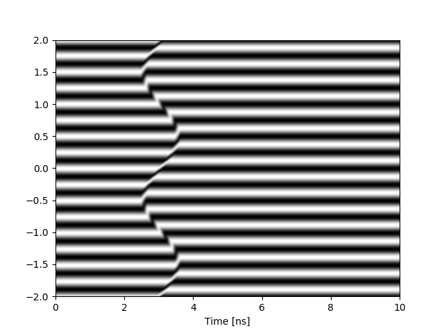
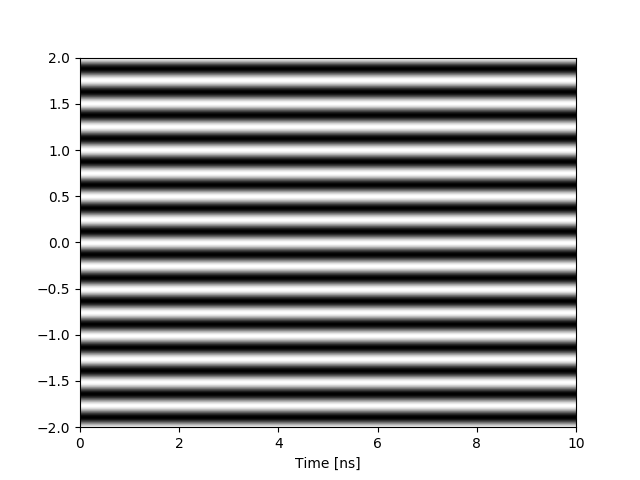

[](https://doi.org/10.5281/zenodo.2578671)


# VISAR Scripts

For a discussion of the theory, please visit [my blog post](https://bdhammel.github.io/2017/06/10/line-visar-analysis.html)

## Analysis

Run the analysis script in an iPython terminal. Click-and-drag the image (png format) in the terminal.

~~~python
>>> %run visar_analysis.py
>>> time, velocity, analysis_params = analyze()

Load png Streak image
Drag and drop location into command prompt
path > /<Path>/smith.png
~~~

### Select working data and reference

This will open up the PNG image in a matplotlib figure. The figure has event handeling enabled, and you will be propted to `Select Working data from raw image` by drawing a rectangle (red) on the figure by clicking and dragging. You must drag from the bottom-left to top-right.



Press <kb>enter</kb> in the terminal to select the region of data. You will then be propted to select a region of reference fringes, drag away from the start of the rectangle (green). Press <kb>enter</kb> in the terminal to confirm selection.

### Select the fundamental frequency

A new window will open for you to select the fringe-spacing frequency of interest. Click on a location of the plot to select the minimum frequency (green), press enter (at the window focus, not the terminal), and select the maximum frequency (red). Press enter in the terminal to end selections.



### Pick Etalon

A menu will prompt you to choose the VPF. The VPFs listed in this menu are determind my the JSON config file `etalon_conf.json`.

~~~bash
Pick an etalon thickness:

	[0]____________1e+03 mm________46.29 km s-1
	[1]____________2e+03 mm________23.14 km s-1
	[2]____________5e+03 mm________9.258 km s-1
	[3]________1.144e+04 mm________4.047 km s-1
	[4]__________1.5e+04 mm________3.086 km s-1
	[5]__________2.5e+04 mm________1.852 km s-1
	[6]__________4.5e+04 mm________1.029 km s-1
	[7]_________9.97e+03 mm________5.175 km s-1
	[8]_________2.53e+04 mm________2.039 km s-1
	[9]______________custom
> 9
Enter custom vpf: 5.4603
~~~

### Subtract Background (optional)

Enter "yes" in the terminal to subtract background fringes. You will be prompted to drag-and-drop a reference image. This will then be processed with the same selections you made to the data. (These parameters are stored in the `ANALYSIS_PARAMS` dictionary. 

### Take a line-out of the data

Using the click-and-drag technique, select a rectangle of interest (green) from the veloctiy map.



`analyse()` will now return time and velocity arrays from your selection, along with a dictionary of the parameters you selected during the analysis

### EXTRA

You will then be propted to add fringe shifts, or invert the velocity trace


## Recalling an old Analysis


### Saving analysis parameters

At the end of the analysis, a `analysis_param` dictionary will be returned. Save this dictionary using the method call 

~~~python
save_parameters(analysis_params, name="name/of/file")
~~~

This will generat a pickle file which can be recalled later

### Loading alaysis parameters

To recall an old analysis session, run the automation method with the pickle analysis_params passed as an argument 

~~~python
automated_analysis(params="name/of/file.npy")
~~~

# Simulate Line-VISAR data

Building simulated data from a velocity profile.


## Simple Example

~~~python
target = Target(velocity_equation="step")
    
ray = Ray(pulse_length=10)
ray = target.reflect_off_target(ray)
    
etalon = Etalon(1, 1.5195)
etalon.set_VPF(2., lambda0=.532)
interferometer = Interferometer(etalon=etalon)
    
sweep = interferometer.output(ray, target)

plt.figure()
plt.imshow(sweep, aspect='auto', cmap="gray", extent=(0, 10, -2, 2))
plt.xlabel("Time [ns]")
~~~


## Target class

The target class defines the velocity profile that will be recorded by the visar system (i.e. the shock front moving / interface velocity of a target of interest).

This velocity profile is loaded during the initialization of the target instance. Two built-in profiles are available for testing.  

 - `step` : a discontinuous velocity jump
 - `sigmoid` : a sigmoid-shaped velocity jump
 - `stationary` : 0 velocity change, used in generating reference images

To help visualize the velocity profile, a helper plotting function is available, and can be called via the following command:

~~~python
target.plot_velocity()
~~~

This generates two plots: a 3D plot of the velocity profile, and a 2D color plot. The 2D should be identical to what the "Visar analysis" script would return for the velocity map, if this simulated data were to be analyzed. 




### Loading a generic velocity profile

User-defined velocity profiles can be loaded. An example of how this is done is demonstrated in the functions

 - `sin_step`
 - `spatial_var_step`

In this case, a callable function is defined, which must except a time value, and a spatial location. If the user defined function requires more arguments, this can be simplified with use of a `lambda` function. e.g.

~~~python
velocity_equation = lambda t, y : sin_step(20, .5, t, y, max_velocity=1)
~~~

the function is then loaded into the target during the initialization of the target instance.

~~~python
target = Target(velocity_equation=velocity_equation)
~~~


 
## Ray class

The `ray` instance defines the duration, as well as the spatial location over which the velocity profile will be recorded.

The values must be less than `target._t` and `target._y`, currently these are hard-coded into the `Target.__init__`, feel free to change them.

## Etalon class

The `etalon` instance sets the VPF of the generated visar data, determined by twice the thickness (two passes through the etalon for a Mach-Zehnder interferometer) and the index of refraction:

~~~python
etalon = Etalon(thickness=1, n=1.5195)
~~~ 

If you would like to explicitly set the VPF instead, this can be done with the helper function `set_VPF`, this then chanced the etalon thickness:

~~~python
etalon.set_VPF(2, labda0=.532)
~~~ 

Similarly, this can be done with the etalon tau (temporal delay, in ns), `set_tau`

## Interferometer class

The interferometer instance will carry out the mechanics of generating the fringe-comb pattern. 

Initilization of the interferometer instance requires 2 arguments. 

~~~python
Interferometer(
    etalon,
    tau,
)
~~~

 - `etalon` An Etalon instance, used in determining the VPF of the generated data
 - `tau` the slit opening on the streak camera, this sets the temporal resolution. 

Generation of the desired data is then accomplished by calling the `output` class method.  

~~~python
sweep = interferometer.output(ray, target, noise=False)
~~~

`output` excepts a `Ray` argument and a `Target` argument, and optional boolean argument to add noise to the generated data is also available; however, this method is still in development. 

## Reference Shot

A helper function is included to quickly generate a reference shot. This just generates the output from a stationary target.

~~~python
reference_shot(
    save=False,
    noise=False
)
~~~



## Cite this work
```
@misc{https://doi.org/10.5281/zenodo.2578671,
  doi = {10.5281/zenodo.2578671},
  url = {https://zenodo.org/record/2578671},
  author = {Hammel,  Ben},
  title = {bdhammel/line-visar-analysis: Initial release},
  publisher = {Zenodo},
  year = {2019}
}
```

B. Hammel. bdhammel/line-visar-analysis: Initial release, 2019.
